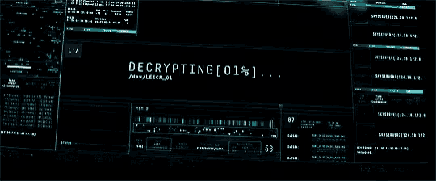

   

#

Estudante de TI Preparado para aprender oque for preciso !. Atualmente estudo C++, javascript, php, para aprimorar as habilidade.
Estou constantemente atualizando meus conhecimentos e buscando novos desafios na área de tecnologia. Tenho paixão por aprender e aplicar esses conhecimentos para criar soluções inovadoras.
  
#

<h3 align="left">Connect with me!</h3>

<h3 align="left">My Skills 📚</h3>

  
  
  
  
  
  
  
  
  
  

#

  <h3>📊 GitHub Stats 📊</h3>
   
  

  

#

<picture align="center">
  <source media="(prefers-color-scheme: dark)" srcset="https://raw.githubusercontent.com/guilhermeteixeira00/guilhermeteixeira00/output/github-contribution-grid-snake-dark.svg">
  <source media="(prefers-color-scheme: light)" srcset="https://raw.githubusercontent.com/guilhermeteixeira00/guilhermeteixeira00/output/github-contribution-grid-snake-dark.svg">
  
</picture>
